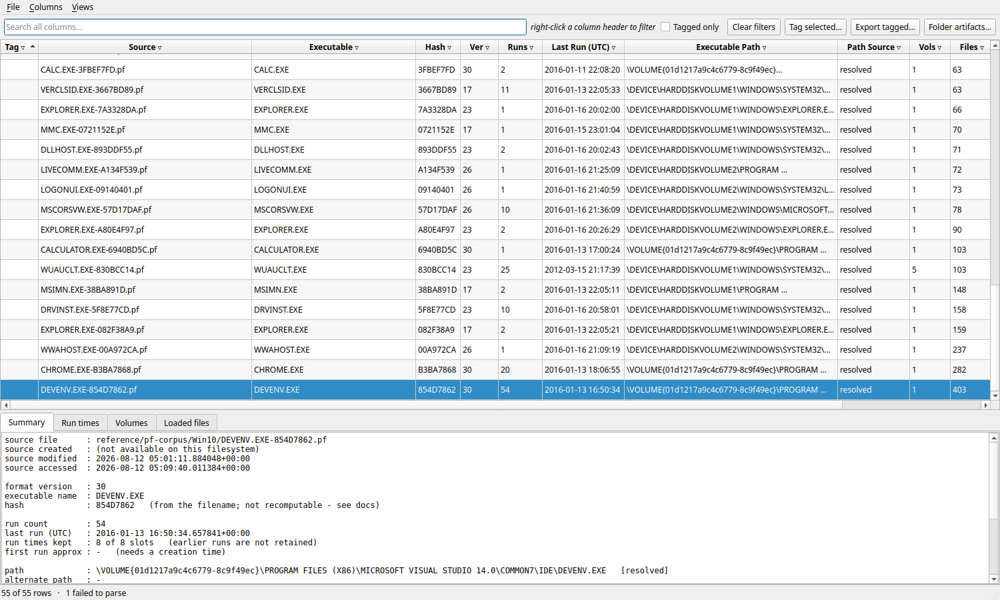

# Prefetch Parser

A cross-platform Windows Prefetch (`.pf`) parser with a CLI and a GUI. Runs on Windows, Linux
and macOS — it does not need Windows to read Windows 10/11 prefetch.



- **Parses every version** — 17, 23, 26, 30, 31 (XP through Windows 11)
- **No Windows dependency** — pure-Python XPRESS Huffman decompressor, so compressed
  Win10/11 prefetch opens anywhere
- **Full executable paths**, from a file field no other tool reads
- **Nothing skipped** — loaded files with MFT references, every volume, directories, trace
  chains, and a row for files that fail to parse
- **The rest of the Prefetch folder too** — `Layout.ini`, SuperFetch databases, and Windows 11
  **ReadyBoot boot traces, decompressed** ([format worked out here](docs/readyboot-format.md))
- **Alternate data streams** — recovers prefetch hidden in an ADS, without pretending the
  carrier's timestamps are its own
- **GUI** with Excel-style per-column filters, tagging and export; **CLI** for scripting

## Quick start

```bash
pip install PySide6                 # GUI only; the CLI and library need nothing

python -m pfcli parse C:\Windows\Prefetch --csv out.csv --db out.db
python -m pfcli info  SOME.EXE-ABCD1234.pf
python -m pfcli ads   C:\Windows\Prefetch      # hunt for prefetch hidden in streams
python -m pfgui       C:\Windows\Prefetch      # GUI
```

## Documentation

**[Full documentation](docs/DOCUMENTATION.md)** — every output field explained, the file format,
how paths are resolved, ADS handling, cross-platform notes, the test suite, and the
**limitations and open questions**.

## Status

17 test suites, all passing. Verified against 690 real prefetch files across all five versions,
and against an independently written parser built from the format specification.

**Not yet run on Windows.** The Windows-specific code paths — the `ntdll` decompressor and ADS
enumeration — are written and unit-tested but have never executed on Windows. See the
[limitations](docs/DOCUMENTATION.md#limitations-and-open-questions).

## Licence

MIT.
