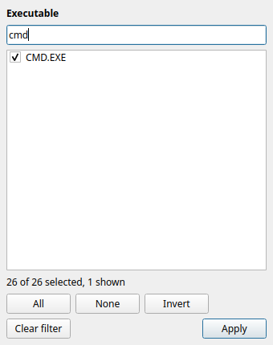
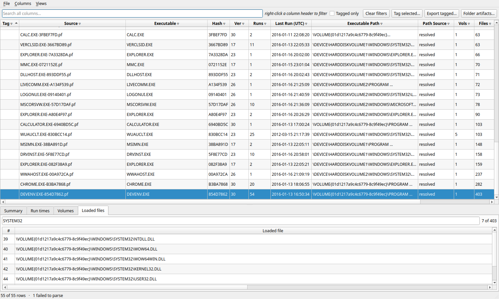

# Prefetch Parser — full documentation

Everything the tool parses, everything it reports, how it decides what it reports, and what it
cannot do. Screenshots use the upstream project's **published sample corpus**, not data from
anyone's machine.

- [What prefetch is](#what-prefetch-is)
- [Installing and running](#installing-and-running)
- [The GUI](#the-gui)
- [Every field explained](#every-field-explained)
- [How the executable path is resolved](#how-the-executable-path-is-resolved)
- [The file format](#the-file-format)
- [Other files in the Prefetch folder](#other-files-in-the-prefetch-folder)
- [Alternate data streams](#alternate-data-streams)
- [Cross-platform](#cross-platform)
- [Outputs](#outputs)
- [Testing](#testing)
- [Limitations and open questions](#limitations-and-open-questions)

---

## What prefetch is

Windows watches roughly the first ten seconds of a process launch and writes
`%SystemRoot%\Prefetch\<NAME>-<HASH>.pf`. Forensically it answers: **this executable ran on
this machine, this many times, at these timestamps, from this volume, and it touched these
files and directories.**

Two things follow that shape everything below:

- A prefetch file is **execution evidence**. The other files in the folder are not.
- Only the **last 8 run times** are kept. `RunCount` can be in the hundreds; the earlier runs
  are gone from the record.

---

## Installing and running

Python 3.10+. The library and CLI have **no dependencies**; the GUI needs PySide6.

```bash
pip install PySide6
```

### CLI

```bash
python -m pfcli parse <path> [--csv out.csv] [--db out.db] [--no-recurse] [--raw-csv]
python -m pfcli info <file.pf>
python -m pfcli artifacts <folder> [--paths]
python -m pfcli ads <folder> [--db out.db] [--files-only]
python -m pfcli capabilities
```

`parse` accepts files or folders and recurses by default (ReadyBoot lives in a subfolder).
Overlapping arguments are de-duplicated, so `parse FOLDER FOLDER` does not double every row.

`ads` reports every entry whose streams could not be enumerated and **exits `1`** when any
were skipped, because a locked or ACL-restricted file is not a file that came back clean — and
on a live system those are exactly the ones worth hiding a payload in.

`artifacts` distinguishes **"scanned and found nothing"** (exit `0`, and it names the folder it
scanned) from **"could not scan"** — a missing path, or a file passed where a folder belongs —
which exits `1`. The first is evidence; the second is not, and `pfcli artifacts "$DIR" && …`
must not treat them alike.

Exit codes: `0` success, `1` nothing parsed or an output could not be written, `2` alternate
data streams cannot be enumerated on this host.

### GUI

```bash
python -m pfgui [folder]
```

---

## The GUI


**Filtering.** Right-click any column header. The dropdown lists the distinct values *available
under the other columns' filters*, with a search box; `All` / `None` / `Invert` act on the
search-narrowed subset, so you can tick forty matching values in one click.



Filters **intersect**. Every header carries a `▿`; an active filter shows `▼`.

**Highlighted rows** mark facts about the evidence, never a verdict about badness:

| Tint | Meaning |
|---|---|
| Red | the file failed to parse — the row is partial |
| Red | the name or path contains deceptive characters |
| Amber | the two path sources disagree (see `Alt Path`) |

Colours are derived from your theme, so they stay legible on light and dark desktops.

**Detail tabs** describe the selected row: Summary, Run times, Volumes, Loaded files. Each is a
sortable, filterable, copyable table.



**Folder artifacts** (toolbar or `Ctrl+R`) opens a *separate* window, because it describes the
whole folder rather than the selected row.

**Other:** `Columns` menu to show/hide (persisted); `Views` menu to save and restore filter
sets; right-click a cell to copy; tag rows with notes; export tagged rows or the current
filtered view.

---

## Every field explained

### Identity

| Field | Meaning |
|---|---|
| `Source` / `source file` | the `.pf` file this row came from |
| `Executable` | the executable name **from the file header**. The header field holds only 29 characters, so long names are cut — see `Name Cut` |
| `Name Cut` | `yes` = the 29-character header field was full. **The path is not truncated**; it comes from elsewhere in the file and is complete, which is how the full name is recovered |
| `Hash` | the hash in the filename, 8 hex digits. **Not recomputable** — see [limitations](#limitations-and-open-questions) |
| `Ver` | format version: 17, 23, 26, 30, 31 |

### Timestamps

| Field | Meaning |
|---|---|
| `source created/modified/accessed` | filesystem timestamps of the `.pf` itself. Creation is only reported where the OS supplies a real birth time |
| `Last Run (UTC)` | the **newest** of the stored run times |
| `run times kept` | how many of the 8 slots hold a time |
| `first run approx` | `source created − 10s`, an estimate of the first execution. Shown with `~`. Blank when no creation time is available |

Everything is UTC.

> **The 8 run-time slots are not reliably newest-first.** In a 636-file corpus, 6 files have a
> newer timestamp in a later slot — near-simultaneous launches recorded out of order. `Last Run`
> is therefore `max()`, not slot 0. The Run times tab shows the **stored order**, because that
> order is itself evidence.

### Paths

| Field | Meaning |
|---|---|
| `Executable Path` | the resolved full path |
| `Path Source` | how it was determined — see [below](#how-the-executable-path-is-resolved) |
| `Alt Path` | the other source's answer when the two disagree |
| `Hosted Package` | the UWP package identity |

**`Hosted Package` is often not the executable.** For generic hosts it names the *package being
hosted*, which the executable name alone cannot tell you:

| Executable that ran | Package it was hosting |
|---|---|
| `\WINDOWS\SYSTEM32\DLLHOST.EXE` | `Microsoft.WindowsTerminal_…` |
| `\WINDOWS\SYSTEM32\RUNTIMEBROKER.EXE` | `Microsoft.StorePurchaseApp_…` |

This is the UWP analogue of knowing which *service* an `svchost.exe` was running. A package
name is `Publisher.Name_Version_Arch__PublisherHash`.

### Counts and contents

| Field | Meaning |
|---|---|
| `Runs` | executions since the record was created. May exceed the 8 retained times |
| `Vols` | volumes referenced. More than one is uncommon and worth noticing |
| `Files` | files recorded during the traced startup window |
| `Dirs` | directories touched |
| `trace chains` | prefetcher block-load bookkeeping (see the format section) |
| `MFT references` | NTFS file references for loaded files — entry number and sequence |

### Flags and status

| Field | Meaning |
|---|---|
| `Op File` | an `Op-*.pf`. Not ordinary prefetch: no embedded path field, and it does not list its own executable |
| `Deceptive` | the name or path contains right-to-left overrides, zero-width or control characters — it *displays* differently from how it is stored. The GUI shows the escaped form; CSV and SQLite carry the raw bytes |
| `Parsed` / `Failed Stage` | whether parsing completed, and which stage stopped it |
| `Problems` | non-fatal findings recorded during parsing |
| `Note` | your own note, attached when tagging |

**Every input produces a row**, including files that fail to parse. A partial record is still
evidence; a file that silently disappears from a report is not.

---

## How the executable path is resolved

Modern prefetch (v30/31) stores the executable's full path in an **undocumented
NUL-terminated UTF-16 string** between the filename block and the volume block, pointed at by
no offset field. No other parser reads it.

Resolution order:

1. **That field**, if it holds a device path → `Path Source: stored`
2. Otherwise **match the executable name against the file list** → `resolved`

`Path Source` values:

| Value | Meaning |
|---|---|
| `stored` | read directly from the file. Most reliable |
| `resolved` | matched against the loaded-file list |
| `conflict` | both sources present and they **disagree**. Both paths are reported |
| `ambiguous` | several candidates, none decisive |
| `unresolved` | no path from any source |

Measured over 636 modern files: 443 exact agreement, 13 where the stored field decisively
picks among candidates (System32 vs SysWOW64, `Git\bin` vs `Git\usr\bin`), 5 conflicts, 2 with
no path from either source.

**Conflicts are a finding, not noise.** All five have `RunCount = 1`, and three are the Edge
updater with `EDGEUPDATE\INSTALL\{guid}` in one source and `EDGEUPDATE\DOWNLOAD\{guid}` in the
other — consistent with the stored field recording where the process *launched from* while the
file list holds a path it occupied earlier. Same file name, different directory, one execution.
The tool reports both and asserts nothing.

**Truncated names.** A 29-character header name cannot match by equality, so a prefix match is
used, taking the *shortest* completion — a bare prefix would also catch `FOO.EXE.CONFIG` and
`FOO.EXE.MUI`.

---

## The file format

A `.pf` is: an 84-byte header, a file-information section, a file-metrics array, trace chains,
a filename string block, and one or more volume records. Windows 10/11 wrap all of it in a
`MAM` container compressed with XPRESS Huffman.

Findings that contradict every public source and the reference implementation:

| Finding | Detail |
|---|---|
| **The executable path is stored outright** | undocumented UTF-16 string; no parser reads it |
| **The file-information section is 212 bytes** on modern builds, 220 on 2015-era v30 — never the 224 the reference uses |
| **RunCount sits 96 bytes before the section end** | the reference probes `+120` and is right by accident |
| **`\VOLUME{hex-hex}` encodes the volume's creation FILETIME and serial** | a free integrity check; it agreed on all 648 volumes tested |
| **The header size field equals the decompressed length** | agreed on all 690 files, so a mismatch is a tamper signal and is reported |

Version 31 is real and structurally identical to modern v30 — an OS label, not a format change.

**Trace chains** are parsed and stored, which no other tool does. Only the "next index" field
is confidently identified; on v17/23/26 the second field behaves like a block-load count and is
exposed as such, and on v30/31 it holds values that are plainly not a count, so it is left
**unnamed** rather than given a label it does not deserve.

Full byte-level specification: [`prefetch-format.md`](prefetch-format.md).

---

## Other files in the Prefetch folder

A Prefetch folder is not only prefetch. These carry **file-access and prefetcher-priority
evidence — not execution**, and have no run times. The GUI keeps them in a separate window for
that reason.

| File | What it is |
|---|---|
| `Layout.ini` | UTF-16 list of files the prefetcher wants laid out contiguously. **The only artifact in the folder with a drive letter**, and on Windows 11 it names user accounts and installed software |
| `PfPre_<hex>.mkd` | a fixed **16,384-slot event ring buffer**. The header count is events *ever written*, so a count above 16,384 means older events were overwritten. The event types are not decoded |
| `*.7db`, `*.ebd` | SuperFetch resource-priority databases. One self-validating container; `.ebd` is MAM-compressed. Holds paths in prefetch's own `\VOLUME{serial}` notation |
| `ReadyBoot/Trace*.fx`, `rblayout.xin` | **per-boot file-access traces.** Fully decompressed — see [ReadyBoot](#readyboot) below. Each file's mtime dates one boot |

Findings measured across 636 real `.pf` files — the two volume notations and the
"ran from N locations" trap, volume creation timestamps, how much execution history the 8-slot
limit destroys, and what interpreter prefetch reveals:
[`prefetch-findings.md`](prefetch-findings.md).

Detailed analysis: [`prefetch-artifacts.md`](prefetch-artifacts.md). What the decoded ReadyBoot
data is worth in a case — drive-letter mapping, boot history, shadow-copy access, and the
caveats that matter: [`readyboot-findings.md`](readyboot-findings.md).

### ReadyBoot

Windows 11 keeps a `ReadyBoot/` subfolder of boot traces in a `PfB` container. This tool
decompresses them; as far as I can tell no other prefetch tool does.

The container is **not** one compressed stream — that is why it resisted decoding for so long.
It is a chain of independently compressed 64 KB XPRESS Huffman chunks:

```
u32  magic 0xE3426650 ('PfB\xe3')
u32  total uncompressed size
u32  compressed length of chunk 0
     chunk 0
     u32 unidentified   u32 length of chunk 1
     chunk 1
     ...
```

Each chunk resets the LZ77 history, so chunks decode independently. The final chunk's declared
length is **not** valid — it must be clamped to the end of the file.

Verified on all six files in the corpus: each decompresses to exactly its declared size, the
chunk count equals `ceil(size / 65536)`, and all 708 chunk boundaries land on a complete
canonical Huffman table. Derivation and evidence: [`readyboot-format.md`](readyboot-format.md).

Inside sits a **directory tree** — records of `[u32 parent offset][u16 length][UTF-16LE name]`
— which resolves into whole paths. Two inner formats put that table in opposite places:
`xFcE` (the traces) keeps it last, `iLdR` (`rblayout.xin`) first at offset 16.

Every link resolves on every file — 8,927 to 20,179 paths each, none dropped:

```
\Device\HarddiskVolume3\Windows\System32\ntoskrnl.exe
\Device\HarddiskVolume3\Windows\System32\WindowsPowerShell\v1.0\powershell.exe
\Device\HarddiskVolume1\EFI\Microsoft\Boot\ko-KR\bootmgfw.efi.mui
\Device\HarddiskVolume3\$Mft
```

They use the same `\Device\HarddiskVolumeN\` notation as `.pf`, so the volume correlation
applies unchanged.

The rest of the payload is the **trace itself** — one 40-byte record per read, carrying the
file, the byte offset, the I/O size and a monotonic tick. A single boot yields 173,000–229,000
events covering 7–9 GB of reads across 4,400–7,200 files, and **every event resolves to a named
file**. The tool reports per-file totals, heaviest first:

```
  394 reads  784.4 MB  \Device\HarddiskVolume3\$WinREAgent\Scratch\update.wim
  384 reads  576.1 MB  \Device\HarddiskVolume3\Windows\System32\config\SOFTWARE
  150 reads  268.1 MB  ...\Windows Defender\Definition Updates\{...}\mpasbase.vdm
```

14-22.5% of events belong to `FI_UNKNOWN` — reads the tracer could not attribute to a file,
mostly from early boot before the filesystem is up. That is the tracer's own marker, not a
decode failure.

Standing caveat: this is **access, not execution**. A path here means the boot read that file,
never that a program ran. Events are ordered and relatively timed by their ticks, but the tick
unit is unknown, so no wall-clock time is claimed for an individual event.

---

## Alternate data streams

An executable launched from an NTFS alternate data stream gets a prefetch file that **itself
lives in a stream**. The carrier's primary stream is typically 0 bytes, so a folder listing
shows an empty file and every tool that globs `*.pf` sees nothing.

```bash
python -m pfcli ads C:\Windows\Prefetch
python -m pfcli ads C:\Users --db out.db
```

This scans **every file regardless of extension, and directories too** (NTFS directory objects
carry streams), and detects prefetch by **content**, not by the stream being named `.pf`.

### The timestamp rule

**A stream has no timestamps of its own.** NTFS keeps them per *file*, not per *stream*, so any
timestamp for an ADS-hosted prefetch belongs to the **carrier**.

| Field | Behaviour for an ADS record |
|---|---|
| `source created` | **stays empty** — never filled from the carrier |
| `first run approx` | **refuses to estimate** |
| `timestamp source` | `stream` / `carrier` / `unavailable` |
| `carrier created/modified/accessed` | the carrier's times, under their own names |

Feeding a carrier's creation time into the first-run estimate would print a confident timestamp
for an execution it has nothing to do with.

**"Cannot look" is never reported as "found nothing."** On a host where streams cannot be
enumerated the command exits 2 and says so.

---

## Cross-platform

The one thing that ties prefetch parsing to Windows is decompression: Win10/11 files are
compressed and the usual approach calls `ntdll!RtlDecompressBufferEx`, which is why the
reference tool refuses to start on other systems.

This tool ships a **pure-Python XPRESS Huffman decompressor** written from Microsoft's
[MS-XCA] specification. It decompresses all 642 compressed files in the test corpora with zero
failures, so Linux and macOS are first-class.

Where `ntdll` is available it is used, chosen by a **capability probe rather than an OS check** —
`ntdll` can be blocked on hardened Windows and is present under Wine. `--decompressor
ntdll|pure` overrides; `pfcli capabilities` reports what is available.

Other platform care:
- **Windows paths are never handled with `os.path`** — it does not split `\` on POSIX.
- **Creation time** comes from `st_birthtime` where it exists, falling back to `st_ctime`
  **on Windows only**, because on Linux that field is inode-change time and would invent
  creation timestamps.
- All timestamps are UTC; output is byte-identical regardless of the machine's timezone.

---

## Outputs

### SQLite (`--db`) — the primary artifact

Relational, so nothing is flattened away: `prefetch`, `run_time`, `volume`, `directory`,
`loaded_file`, `file_ref`, `problem`, plus a `timeline` view of one row per execution. Trace
chains are stored as a blob rather than millions of rows.

Ingest is **idempotent per source file**, so re-scanning a folder updates rather than
duplicates. The database is self-contained — journal mode is `DELETE`, not WAL, so a copied
`.db` is complete even if the process was killed mid-run.

### CSV (`--csv`) — an export

A **strict superset of PECmd's columns** — all 27, plus 14 more.

Two safety behaviours, because a filename is attacker-chosen and a forensic CSV is opened in a
spreadsheet:

- **Formula injection** — a cell starting `=`, `+`, `-`, `@`, tab or CR is prefixed with `'`.
  Values that are simply numbers are left exact. `--raw-csv` disables this.
- **List cells** hold multiple values separated by ` | `, with a literal `|` escaped as `^p`
  (and `^` as `^^`), so an element containing the separator cannot inject extra entries.

The SQLite store is never sanitised — it is the source of truth.

### What the exports do *not* contain

`--db` and `--csv` carry **`.pf` records only**. The other Prefetch-folder artifacts —
`Layout.ini`, the SuperFetch databases and the ReadyBoot traces, including ReadyBoot's per-file
I/O totals — are reported by `pfcli artifacts` and the GUI's *Folder artifacts* window, and are
not written to either export.

That is deliberate: they are a different kind of evidence (access, not execution) with a
different shape, and merging them into a per-execution table would invite exactly the
misreading the whole artifact section is written to prevent. It does mean the fidelity
guarantee described under [Testing](#testing) — every value in CSV, SQLite, the grid and the
detail panes matching the parsed record — is a statement about `.pf` records, not about
artifacts.

### Differences from PECmd, deliberate

| | PECmd | Here |
|---|---|---|
| Hash | printed with `X`, dropping leading zeros — **13 of 160** files disagreed with their own filename | 8 digits always |
| `LastRun` | slot 0 | `max()` of the run times |
| Executable path | resolved only in the timeline CSV, so its two outputs disagree | resolved once in the core |
| Volumes | first two, then a note | all of them |
| Directories | concatenated across volumes with no separator | volume-tagged |
| Failed files | console only | a row, with the failing stage |

---

## Testing

```bash
export PREFETCH_CORPUS_WIN10=/path/to/a/Win10/Prefetch
export PREFETCH_CORPUS_WIN11=/path/to/a/Win11/Prefetch
export PECMD_CSV=/path/to/PECmd_Output.csv        # optional
./run_tests.sh
```

Real prefetch contains the account names and installed software of the machine it came from, so
**the corpora are not in this repository** — their location is configuration. The vendored
`reference/pf-corpus/` is the upstream project's published sample data.

| Suite | What it pins |
|---|---|
| `validate_spec` | an independent parser written from the format doc alone, 683 files |
| `test_core_vs_spec` | the library agrees with it field-for-field, 690 files, all 5 versions |
| `fuzz_parser` | 1,464 malformed inputs: no crash, no hang, no silent garbage |
| `diff_against_pecmd` | agreement with real PECmd output |
| `test_output_fidelity` | **every value in the CSV, database, grid and detail panes matches the parsed record exactly** |
| `test_store` | relational invariants, idempotent re-ingest, durability after a kill |
| `test_csv_coverage` / `test_csv_escaping` | column superset; injection and escaping |
| `test_gui_logic` | filter/sort/tag semantics, contrast on light and dark themes |
| `test_artifacts` / `test_ads` | non-`.pf` parsing; ADS logic and the carrier-timestamp rule |
| `test_memory` / `test_layering` / `test_cli_errors` | memory ceiling; the core stays Qt-free; failures are useful |

---

## Limitations and open questions

Stated plainly, because a forensic tool that hides its limits is worse than one that has them.

### Not yet run on Windows

The Windows-specific paths — the `ntdll` decompressor and `FindFirstStreamW` stream
enumeration — are written and unit-tested against a simulated backend, but **have never
executed on Windows**. Everything above those calls is tested; the calls themselves are not.

### No Windows `.exe` yet — but the bundle has now been built and measured

PyInstaller does not cross-compile, so a `.exe` has to be produced **on Windows**. What exists
is a Linux build of the same spec, which settles the sizes:

| Build | Size |
|---|---|
| GUI + CLI, `--onedir` (what the spec produces) | **179 MB** |
| the same, zipped for distribution | 108 MB |
| CLI only, `--onedir` | **24 MB** |
| CLI only, `--onefile` | **11 MB** |

The split is entirely Qt. The library and CLI have no dependencies, which is why dropping the
GUI takes 179 MB to 24 MB.

About **70 MB of the GUI bundle is reachable-but-unused**, measured per inode (the tree
hardlinks, so summing file sizes double-counts):

| Component | Size | Why it is there |
|---|---|---|
| `libicudata` | 30.6 MB | Qt internationalisation tables |
| Qt Quick / Qml / Pdf / Network | 23.7 MB | never imported — the GUI uses only QtWidgets, QtCore, QtGui |
| GTK theme | 8.3 MB | Linux platform integration; absent on a Windows build |
| OpenSSL | 7.1 MB | pulled in by Qt Network |

Excluding those brings the GUI bundle to roughly **110 MB**, and a Windows build starts ~8 MB
lower again because the GTK theme is not involved.

Both frozen binaries were smoke-tested: the CLI parses a compressed Windows 11 prefetch file
and resolves the executable path, and the GUI starts Qt successfully.

`--onedir`, not `--onefile`, is deliberate for the GUI: onefile unpacks to a temp directory on
every launch, which is slow for a Qt app, and self-extraction is a strong antivirus heuristic
on top of an already frequently-flagged packed Python binary. The CLI has neither problem,
which is why an 11 MB single-file `pfcli.exe` is a reasonable thing to ship on its own.

### The filename hash cannot be recomputed

All three published algorithms were implemented and run against the stored paths: **0 matches
in 463 files.** And the hash is not a function of the path alone — `MSEDGE.EXE` has seven
prefetch files with *near-consecutive* hashes, which no digest produces for seven distinct
paths.

**Consequence:** multiple prefetch files for one executable name is **normal**, not evidence of
multiple locations. The widely repeated "several hashes ⇒ ran from several places ⇒ suspicious"
heuristic false-positives on `svchost`, `runtimebroker`, `dllhost` and `msedge` on any normal
system. Compare resolved **paths** instead.

### ReadyBoot: three fields and the tick unit

The container, chunk chain, name table, path tree and I/O trace are all decoded (see
[ReadyBoot](#readyboot)); every event resolves to a named file. What remains unidentified is
small: two flag words and the last dword of each I/O record, a constant `402` that never
varies, and the 4-byte field between chunks.

The event **tick unit** is inferred rather than read. Two physical constraints put it at
microseconds — that reading gives 35–81 second traces at 100–256 MB/s, where milliseconds would
give 10–22 hour traces at 0.1 MB/s — but the file never states it. Raw ticks are stored, and
the derived figure is named `io_seconds_assuming_us` so the assumption is visible.

### `PfPre_*.mkd` semantics unknown

The structure is proven (16,384-slot ring, cumulative counter) and the third field is a
monotonic clock whose single backwards step confirms the ring wrapped. Field 2 is an
identifier **shared between unrelated Windows installations** — 27 values appear on both
corpus machines — so it hashes or tags something shipped with Windows rather than anything
machine-specific. It is not a prefetch filename hash (1 of 107 values matches any of 636
corpus hashes, i.e. chance).

Not identified: which event each of the ~12 types represents, and what field 2 hashes. The
filename's hex digits match neither the header identifier nor any volume serial in the corpus.
The tool reports the structure and the counts, and claims no semantics.

### Path conflicts unexplained

Five files where the two path sources disagree. The launch-path-versus-earlier-path hypothesis
fits four of five; it is not proven, so the tool reports both and asserts nothing.

### `Op-*.pf`

Detected and flagged. They lack the embedded path field and do not list their own executable,
so **no method recovers a path** for them — 2 of 636.

### Things that cannot be checked from a copied folder

Copying a Prefetch folder to a non-NTFS filesystem loses alternate data streams and creation
times. `first run approx` therefore cannot be validated against such a copy, and ADS recovery
cannot be exercised at all. Both need a live Windows host or a raw NTFS image.

### Access artifacts are not execution artifacts

`Layout.ini`, the SuperFetch databases and ReadyBoot record that a file was *accessed* or
prioritised. They carry no timestamps and prove nothing about execution. The tool separates
them deliberately; do not read a `Layout.ini` path as "this program ran".
